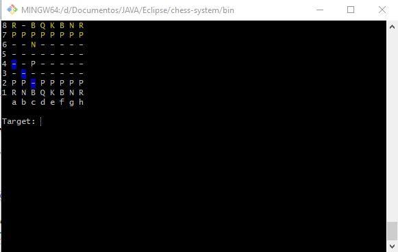

@author Daniel Gil

# Sistema
## Jogo Xadrez

Sistema de jogo de xadrez player vs player, sem UI, modo terminal, mostra movimentos possíveis, peças movem-se através de coordenadas ( a2(Pawn White), d3(Queen White), H7(Pawn black), f8(Knight black))

## Exemplos:

